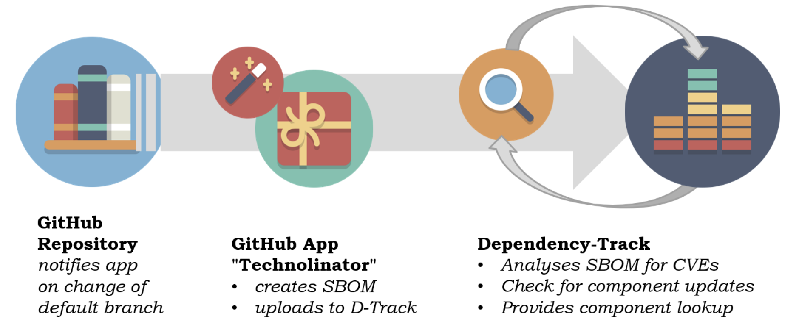

# Technolinator

**The GitHub app for pull-request vulnerability analysis as well as SBOM creation and upload to Dependency-Track.**

 
   

🚢 

It wraps around
*  which covers many programming languages and build systems for SBOM creation
*  for rating the quality of a sbom
*  for creation of vulnerability reports in pull-requests
* or optional  as alternative to depscan

It's built using [%20%3D%20'quarkus.platform.version'%5D%2Ftext()&style=flat-square&label=Quarkus)](https://quarkus.io/) with GitHub integration handled by [%20%3D%20'quarkus-github-app.version'%5D%2Ftext()&style=flat-square&label=Quarkiverse%20GitHub%20App)](https://quarkiverse.github.io/quarkiverse-docs/quarkus-github-app/dev/index.html).

## Overview

## Documentation

* Using Technolinator
  * [Repository specific configuration](docs/Repository_Config.md)
* Operating Technolinator
  * [Runtime configuration](docs/Runtime_Config.md)
  * [Deployment configuration](docs/Deployment_Config.md)
  * [Adopting to your needs](docs/Adoption.md)
* Maintaining Technolinator
  * [Project structure](docs/Project_Structure.md)
  * [Contribution](docs/Contribution.md)

---

_This repository is published under the [Apache License 2.0](https://www.apache.org/licenses/LICENSE-2.0)_

**_get to know us 👉 [https://mms.tech](https://mms.tech) 👈_**
