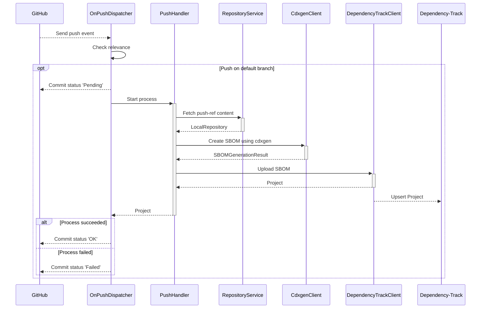

# Inside Technolinator

## Process overview

```mermaid
sequenceDiagram

    GitHub -->> OnPushDispatcher: Send push event
    OnPushDispatcher ->> OnPushDispatcher: Check relevance

    opt Push on default branch

        OnPushDispatcher -->> GitHub: Commit status 'Pending'
        OnPushDispatcher ->>+ PushHandler: Start process

        PushHandler ->>+ RepositoryService: Fetch push-ref content
        RepositoryService -->>- PushHandler: LocalRepository

        PushHandler ->>+ CdxgenClient: Create SBOM using cdxgen
        CdxgenClient -->>- PushHandler: SBOMGenerationResult

        PushHandler ->>+ DependencyTrackClient: Upload SBOM
        DependencyTrackClient -->>- PushHandler: Project

        DependencyTrackClient -->> Dependency-Track: Upsert Project

        PushHandler -->>- OnPushDispatcher: Project

        alt Process succeeded
            OnPushDispatcher -->> GitHub: Commit status 'OK'
        else Process failed
            OnPushDispatcher -->> GitHub: Commit status 'Failed'
        end

    end
```
